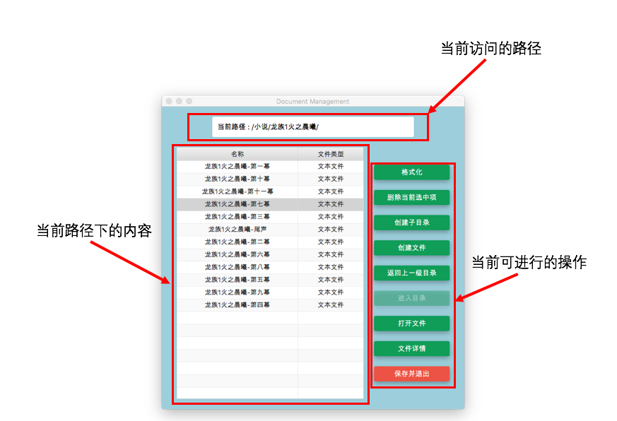
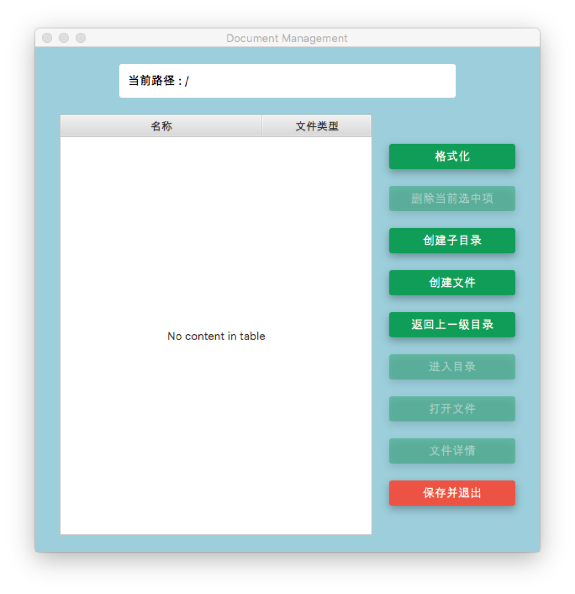
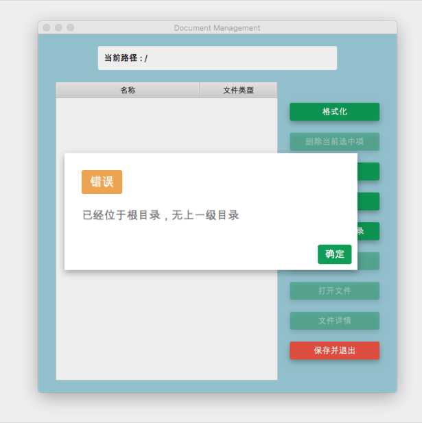
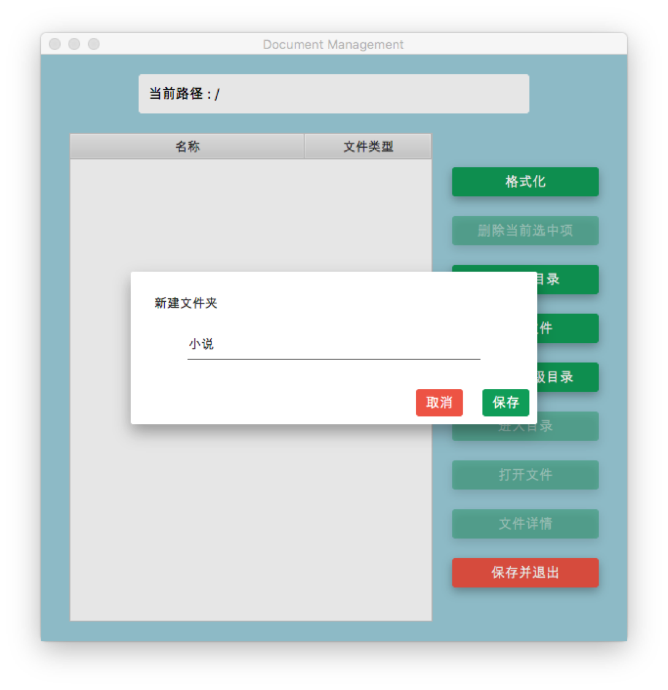
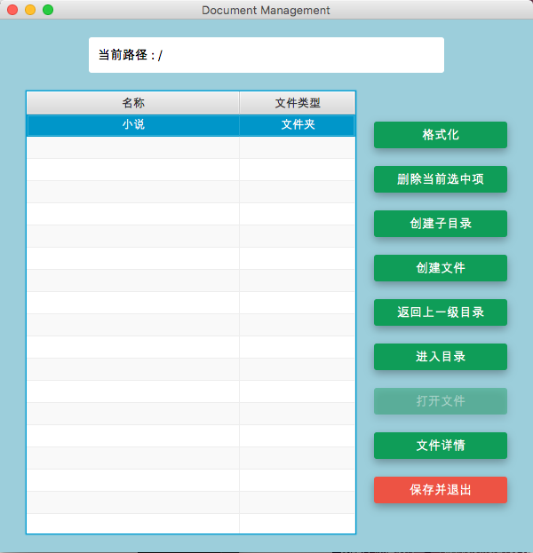
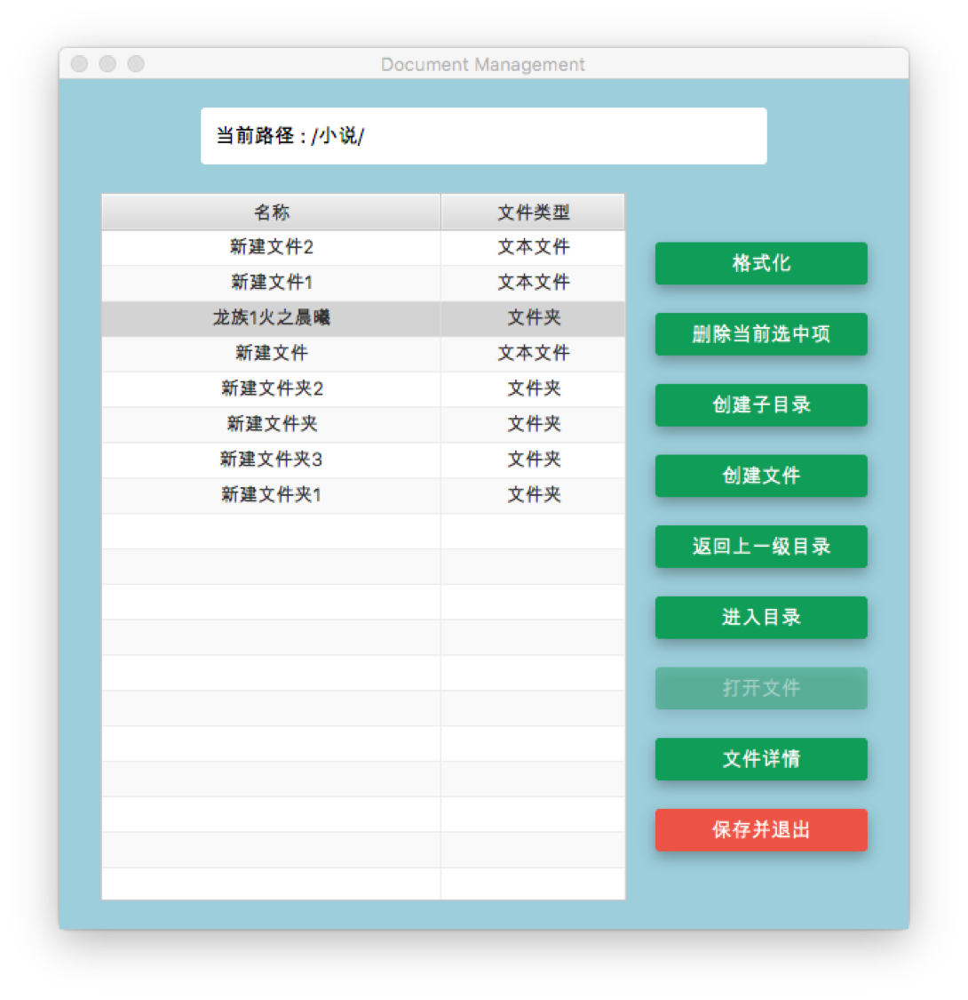
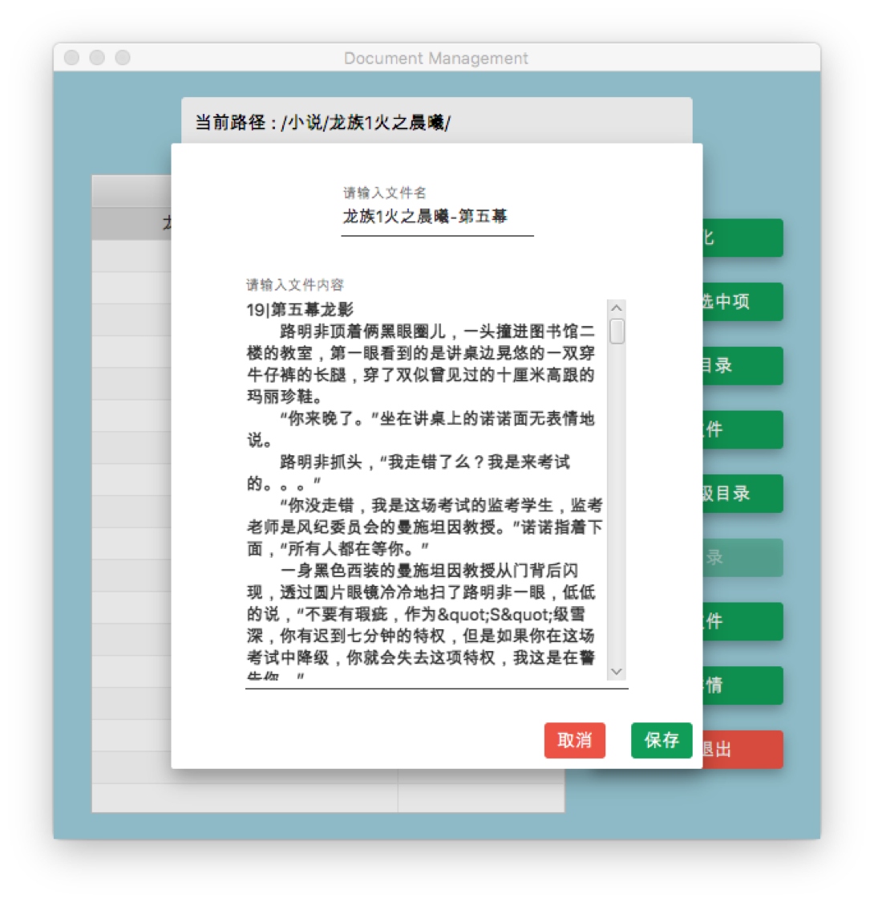
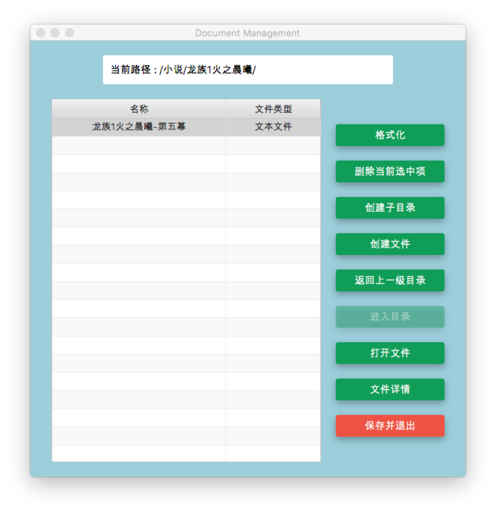
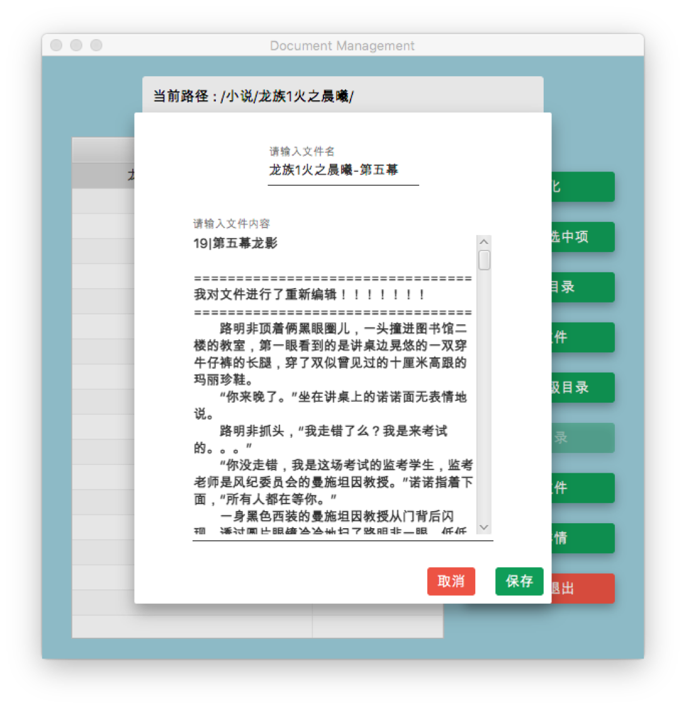
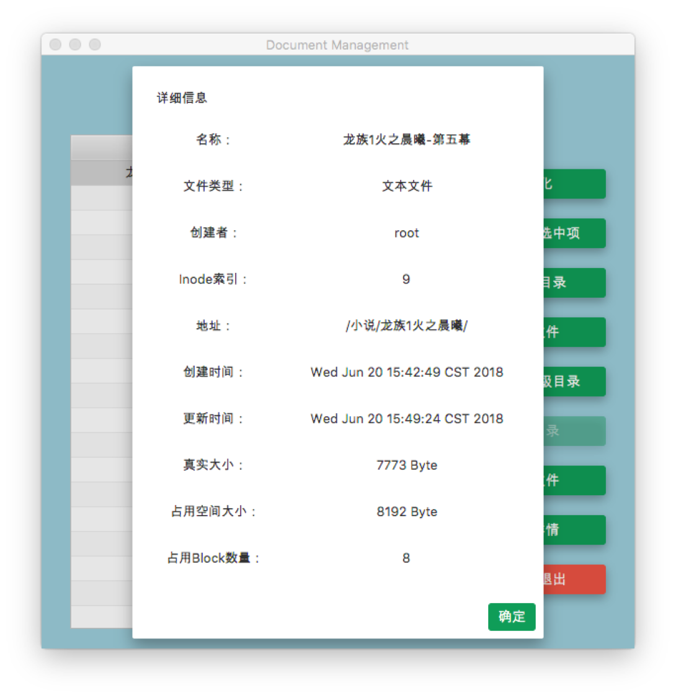

# 文件系统项目    方案报告

#### 操作说明

> 演示效果可参照附件中的demo.mov截屏录像。

整个界面可以分为三部分，上面的部分显示当前GUI当前访问的路径，下面左边部分显示当前路径下的内容，右边部分显示目前可以进行的操作按钮，不可操作的按钮会自动变为失效状态。



以新进入一个空白文件系统为例：

- 刚进入文件系统时，只能进行 `格式化` 、 `创建子目录` 、` 创建文件 `、`返回上一级目录 `、 `保存并退出` 这五项操作，因为未选中任何项目（当前文件系统为空），所以无法进行 `删除当前选中项` 、 `进入目录`、`打开文件 `、 `文件详情` 这四项操作。



- 因为此时位于根目录，当在根目录点击 `返回上一级目录 `时，会弹出已无上一级目录的提示



- 点击` 创建子目录 `按钮，输入文件夹名称即可创建一个子目录



- 选中该文件夹，点击 `进入目录`，即可访问该文件夹。此时可以看出，因为选中了一项内容，部分功能被激活。其中，`进入目录` 按钮仅在选中项为文件夹时才被激活；`打开文件` 按钮仅在选中项为文本文件时被激活。



- 如果不输入文件/文件夹名称，系统会自动补全文件/文件夹名称，同名文件/文件夹则会在后面标注序号



- 点击`创建文件`，则可创建一个文本文件。在新弹出的窗口输入 `文件名` 和` 文本内容`，点击 `保存 `即可将文本文件存入文件系统。





- 再次选中文件，并点击`打开文件`，则可以对刚刚保存的文件进行编辑



- 选中文件并点击`文件详情`，即可显示该文件的详细信息，其中：
  - 可以分别看到该文本文件的`创建时间`和`最近一次修改时间`，从截图信息可以看出，由于之前对文本文件进行了修改，该文本文件的创建时间和更新时间是不同的
  - `Inode索引`对应真实存储过程中记录存储块信息的Inode节点的索引信息
  - `真实大小`指包括文件名和文件内容在内的存储字符串的真实大小。因为采用data block来进行文件存储，本文件系统定义的文件大小为固定的1K，即1024 Byte，存储所用的block编号记录在Inode节点中，所以文件的真实大小为 7773 Byte，在实际存储空间中占用8个 data block 进行存储，故实际`占用空间大小`为 8 * 1024 Byte = 8192 Byte



- 选中文件/文件夹，点击 `删除当前选中项` 按钮，即可将文件删除
- 点击下方的红色按钮 `保存并退出` 或直接点击窗口栏的关闭按钮，即可将当前的文件和文件夹保存到磁盘中，下次启动时就会从磁盘中相应位置直接读取已经保存的内容，如果不存在已经保存的内容则会重新创建存储空间。
- 点击 `格式化` 按钮会清空整个存储空间，重新分配各个Inode和 data block。


#### 数据结构

- Super Block：记录file system 整体的信息，包括Inode的整体数量、Block的整体数量，利用Inode bit map来记录Inode的使用情况和空闲情况，利用Block bit map来记录Block的使用情况和空闲情况。

  ```java
  public static final int MAX_INODE_NUMBER = 128;
  public static final int MAX_BLOCK_NUMBER = 128 * 12;

  public List<Inode> _inode_table = new ArrayList<Inode>();
  public List<Block> _block_table = new ArrayList<Block>();
  public boolean[] _inode_bit_map;
  public boolean[] _block_bit_map;

  private static final int SIZE_PER_BLOCK = 1024;
  ```

- Inode：记录文件的属性，一个文件对应一个Inode，包括Inode索引、创建时间、修改时间、直接索引数量、间接索引数量、占用块的数量、文件大小，同时也记录了用于存储的数据所在的Block的索引。当一个文件太大时，可能会占用多个Block。

  ```java
  private int _inode_index;
  private Date _created_at;
  private Date _updated_at;
  private int _size;

  private static final int MAX_DIRECT_INDEX = 12;
  private static final int MAX_INDIRECT_INDEX = 3;

  public List<Block> _direct_access_blocks = new ArrayList<Block>();
  public List<Block> _indirect_access_blocks = new ArrayList<Block>();
  ```

- FCB：记录目录里存放的业务数据，目录里的索引节点指向对应的Inode节点

  ```java
  private static final int SIZE_PER_BLOCK = 1024;

  public String name;
  public String type;
  public String owner;
  public String content;
  public int inode_index;
  public int actual_size;
  public int occupied_size;
  public String address;
  public Date created_at;
  public Date updated_at;

  public Map<String, FCB> path_tree;
  ```

- Block：即Data Block，用于存放实际数据。在本文件管理系统的实现中，一个Block的大小定义为1024 Byte

  ```java
  private static final int SIZE_PER_BLOCK = 1024;
  private int _block_size;
  private int _block_index;
  ```


#### 设计与存储空间

- 对于一个文件，Inode采用12个直接指向的Block作为直接存储，以及三级间接存储作为拓展存储空间，其存储方式如下图所示：


- 在本实现中，因为保存的文件均为文本文件，占用空间数量不高，则仅针对直接索引进行了实现，但保留了间接索引的接口。

- 在设计理论中，一个Block大小规定为1KB，一个Inode能够指定的Block数量如下所示：

  - 12个直接指向：12 * 1K = 12K
  - 间接指向：256 * 1K = 256K
  - 双间接指向：256 * 256 * 1K  = 256^2 K
  - 三间接指向：256 * 256 * 256 * 1K = 256^3K

  总额为 12 + 256 + 256^2 + 256^3 = 16GB


