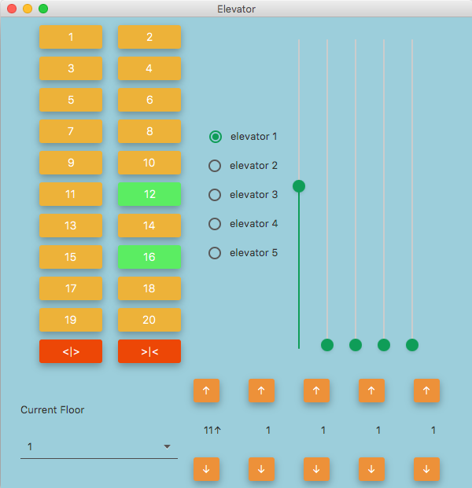
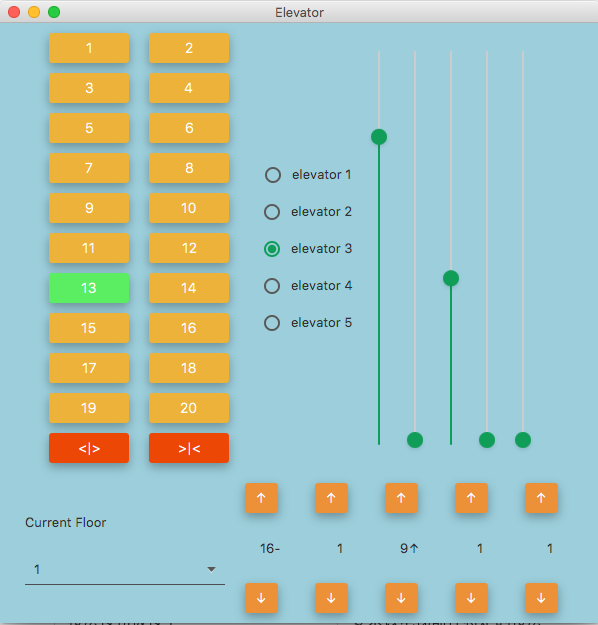
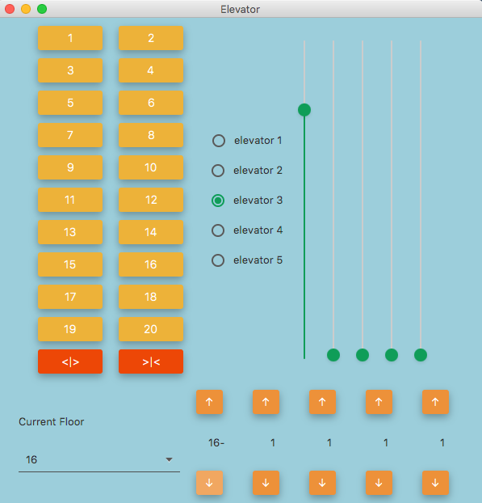
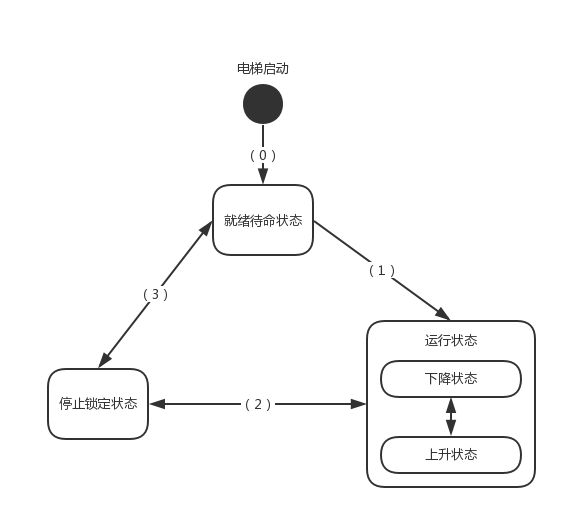

# 电梯调度    方案报告

>  1553321 - 李坤

##### 操作说明： 

- 主界面：

  电梯的主界面被划分为上下两部分

  上面的部分从左到右依次是：单一电梯内的所有按钮，电梯选择按钮，电梯运行图示（用slider表示）

  下面的部分从左到右依次是：楼层选择下拉框，楼层内上行、下行按钮和电梯状态显示

  

- 使用电梯内置功能键：

  - 按下电梯内功能键，电梯即可向指定的楼层移动，**电梯待命及运行时，滑动条为绿色，表示电梯可响应自身按键及来自其他楼层的呼叫**

  

  - 当电梯到达某一目标楼层时，**电梯图示滑动条变为灰色，表示电梯被锁定，正在上下客**

  

  - 点击不同电梯即可切换当前操纵的电梯，图示切换到了elevator 3

  

- 使用楼层功能按键

  - 通过current floor下拉框，选择当前所在楼层，图示选择了16楼，并按动下行按钮呼叫向下的电梯，当一个按钮被点亮时，所有对应按钮都被点亮

  

  - 当电梯到达目标楼层时，按钮熄灭

  

##### 本电梯共有四个状态，分别是：

| 状态         | 描述                                                         |
| ------------ | ------------------------------------------------------------ |
| 上升状态     | 电梯上行移动中                                               |
| 下降状态     | 电梯下行移动中                                               |
| 停止锁定状态 | 电梯到达某楼层，开门上下课，位置锁定，不响应任何移动请求     |
| 就绪待命状态 | 电梯停留在某个楼层待命，可响应来自其他楼层的移动请求或来自本楼层的请求 |

其状态转移图如下所示：

##### 调度系统可接受的事件如下：

- 来自电梯自身的事件

  | 事件           | 描述                     |
  | -------------- | ------------------------ |
  | 楼层按钮被按下 | 要求该电梯前往特定的楼层 |

  > 调度算法：
  >
  > - 当电梯处于待命状态时，优先响应被首先按下的按钮所指示的目标楼层
  >
  > - 当电梯处于上行状态时，响应顺序为：
  >
  >   比当前楼层高的最近的目标楼层  >  比当前楼层高的其他楼层  >  比当前楼层低的最近的目标楼层  >  比当前楼层低的其他楼层
  >
  > - 当电梯处于下行状态时，响应顺序为：
  >
  >   比当前楼层低的最近的目标楼层  >  比当前楼层低的其他楼层  >  比当前楼层高的最近的目标楼层  >  比当前楼层高的其他楼层
  >
  > 当电梯运行过程中，可按动多个楼层按钮，电梯会自动将目标楼层按照以上原则加入任务列表

- 来自各楼层的事件

  | 操作                 | 描述                                                   |
  | -------------------- | ------------------------------------------------------ |
  | 某楼层上行按钮被按下 | 要求某一部合适的电梯前往某固定楼层，且从该楼层出发上行 |
  | 某楼层下行按钮被按下 | 要求某一部合适的电梯前往某固定楼层，且从该楼层出发下行 |

  > 调度算法：
  >
  > - 当所有电梯均处于待命状态时，指派距离当前楼层最近的电梯前往
  >
  > - 当有电梯正在运行中时：
  >
  >   | 按下按钮 | 电梯状态                         | 调度                                                         |
  >   | -------- | -------------------------------- | ------------------------------------------------------------ |
  >   | 上行     | 存在正在上行且低于当前楼层的电梯 | 指派距离当前楼层最近的上行中的电梯                           |
  >   | 上行     | 无正在上行且低于当前楼层的电梯   | 从下行状态和静止待命状态的电梯中，指派距离当前电梯最近的电梯 |
  >   | 下行     | 存在正在下行且高于当前楼层的电梯 | 指派距离当前楼层最近的下行中的电梯                           |
  >   | 下行     | 无正在下行且高于当前楼层的电梯   | 从上行状态和静止待命状态的电梯中，指派距离当前电梯最近的电梯 |

## 各状态的转换条件

##### 0.	电梯启动到就绪待命状态

启动五个单独的电梯线程，与GUI线程之间通过五个独立的且线程安全的 `BlockingQueue` 进行通讯，向每个按钮绑定按下后的回调函数，初始化电梯状态为 `REST(就绪待命)`。

##### 1.1 	就绪待命状态到运行状态

当电梯处于待命状态时，既可以响应来自电梯内部按钮的请求也可以响应来自楼层调度的请求。收到需要前往的楼层时，把目标楼层加入TreeSet，避免楼层按钮被多次按动，遍历TreeSet得到有序任务表，根据目标楼层是否高于当前楼层，选择把电梯状态设置为`UP(上升状态)` 或`DOWN(下降状态)`，并

##### 1.2  上升状态到下降状态

当电梯处于上升状态，且任务列表中无高于电梯目前所在楼层的目标楼层时，电梯状态切换为`DOWN`，同时选择任务列表里离当前楼层最近的一层前往。

##### 1.3 	下降状态到上升状态

当电梯处于下降状态，且任务列表中无低于电梯目前所在楼层的目标楼层时，电梯状态切换为UP，同时选择任务列表里离当前楼层最近的一层前往。

##### 2.1	运行状态到停止锁定状态

当电梯到达一个目标楼层时，从任务列表里取出该楼层的目标信息，同时熄灭该楼层的指示灯，将楼层状态显示器上的状态设置为停止，将表示电梯运行图示的滑动条设置为灰色，表示目前锁定运行，开门上下客，电梯线程休眠2秒。

##### 2.2	从停止锁定状态到运行状态

当电梯上下客后，遍历TreeSet得到有序任务表，根据以下原则选择下一个前往的楼层：

- 当电梯自身处于`REST`状态时

  电梯选择有序任务表中离目前电梯所在楼层最近的一层前往。

- 当电梯自身处于`UP`状态时

  电梯选择有序任务列表中高于目前电梯所在楼层且最近的一层前往。

- 当电梯自身处于`DOWN`状态时

  电梯选择有序任务列表中低于目前电梯所在楼层且最近的一层前往。

##### 3.1  从停止锁定状态到就绪待命状态

当电梯上下客结束且任务列表为空时，电梯切换为`REST`状态，将电梯运行图示的滑动条设置为表示可用的绿色，表示待命

##### 3.2	从就绪待命到停止锁定状态

当电梯当前所在楼层按钮被按动时，熄灭该楼层的指示灯，将楼层状态显示器上的状态设置为停止，将表示电梯运行图示的滑动条设置为灰色，表示目前锁定运行，开门上下客，电梯线程休眠2秒。