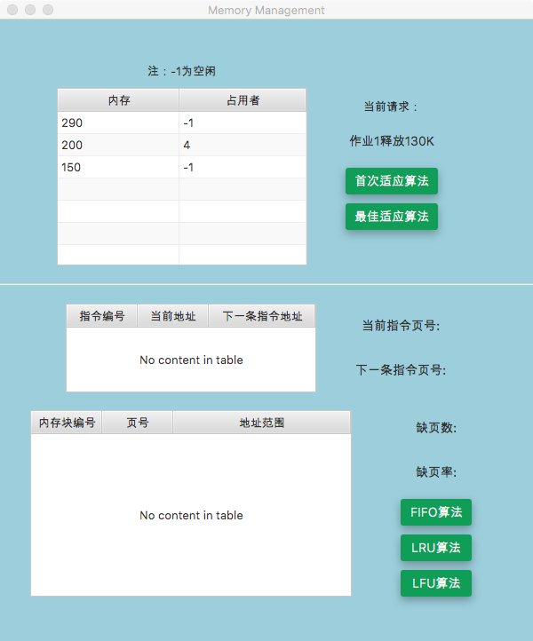
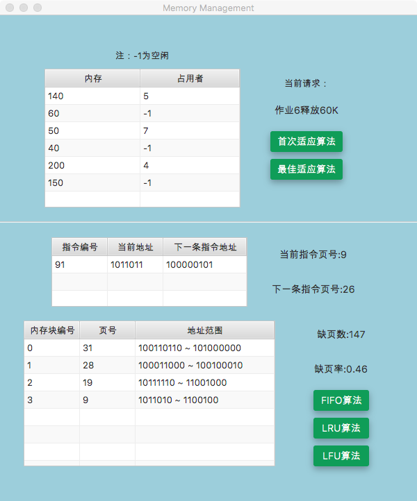

# 内存管理项目    方案报告

#### 操作说明

界面被分割线划分为两部分，上面的部分为动态分区分配方式的模拟，下面的部分为请求调页存储管理方式的模拟。两个部分可同时进行模拟，互不干扰。

- 动态分区分配方式
  - 点击 `首次适应算法` 按钮来进行动态分区分配方式的模拟
  - 点击 `最佳适应算法` 按钮来进行请求调页存储管理方式的模拟

- 请求调页存储管理方式
  - 点击 `FIFO算法` 按钮，采用FIFO算法作为置换算法
  - 点击 `LRU算法` 按钮，采用LRU算法作为置换算法
  - 点击 `LFU算法` 按钮，采用LFU算法作为置换算法

#### 动态分区分配方式的实现

- **首次适应算法**

  [首次适应算法演示视频](./FF.mov)

  在内部维护一个`ObservableList` 模拟分区链表，对不同请求作如下操作：

  - 申请分配内存请求：从空闲分区表的第一个表开始查找该表，把最先访问到的能够满足要求的空闲分区分配给发出申请的作业，分配剩下的空闲部分分裂为一个链表节点，留在空闲分区链中
  - 释放内存请求：把该作业占用的链表节点标记为空闲，检查前后是否存在同样的空闲分区，如果存在，则将两个空闲分区链表节点合并为一个

- **最佳适应算法**

  [最佳适应算法演示视频](./BF.mov)

  在内部维护一个`ObservableList` 模拟分区链表，同时维护一个普通 `empty_block List` ，用于记录空闲分区的大小顺序，对不同请求作如下操作：

  - 申请分配内存请求：从已经按从小到大排好序的空闲分区查找表中查找能够满足要求的最小空闲分区索引，从分区链表中访问该分区，分配给发出申请的作业，分配剩下的空闲部分分裂为一个链表节点，留在空闲分区链中，同时更新空闲分区查找表，将空闲分区索引按分区大小从小到大进行排序。
  - 释放内存请求：把该作业占用的链表节点标记为空闲，检查前后是否存在同样的空闲分区，如果存在，则将两个空闲分区链表节点合并为一个，同时更新空闲分区查找表，将空闲分区索引按分区大小从小到大进行排序。

#### 请求调页存储管理方式

- **指令生成**

  模拟运行的指令采用以下规则生成：

  - 第1-20条指令和第300-319条指令一定是顺序运行，且第320条指令一定向前跳转。
  - 当同一条指令被访问超过三次后，该指令指向的下一条指令会改变为一条新指令，模拟循环完成后达到判断条件后执行新的指令。
  - 除上述特殊指令，其他指令中，百分之五十位顺序执行指令，百分之二十五为向前跳转指令，百分之二十五为向后跳转指令。

- **FIFO算法**

  [FIFO运行演示视频](./FIFO.mov)

  按照先进先出的原则进行换页，内部维护一个队列：

  - 发生缺页时，新分配内存的页加入队列尾部。
  - 需要页置换的时候，将队列头部的页面移出内存。

- **LRU算法**

  [LRU运行演示视频](./LRU.mov)

  按照最近最少使用的原则进行换页，内部维护一个链表：

  - 每次有一条指令执行时，如果缓存命中，则将该页移到链表头部
  - 当发生缺页时，新分配内存的页被插入到链表头部
  - 当需要进行页置换时，将链表尾部的页移出内存

- **LFU算法**

  [LFU运行演示视频](./LFU.mov)

  按照历史访问频率最低的原则进行换页，内部维护一个队列，对每一个数据块都有一个引用计数，所有数据块按照引用计数排序：

  - 每次有一条指令执行时，如果缓存命中，则该数据块的引用计数加1
  - 当发生缺页时，新分配内存的页被插入到队列尾部，引用计数初始化为1
  - 当需要进行页置换时，将引用计数最低的页面置换出去

- **运行结果比较**

  | 算法 | 缺页数 | 缺页率 |
  | :--: | :----: | :----: |
  | FIFO |  133   |  0.42  |
  | LRU  |  147   |  0.46  |
  | LFU  |  153   |  0.48  |

  ​